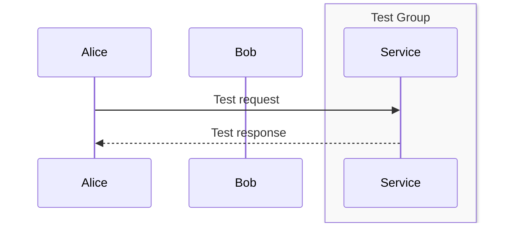
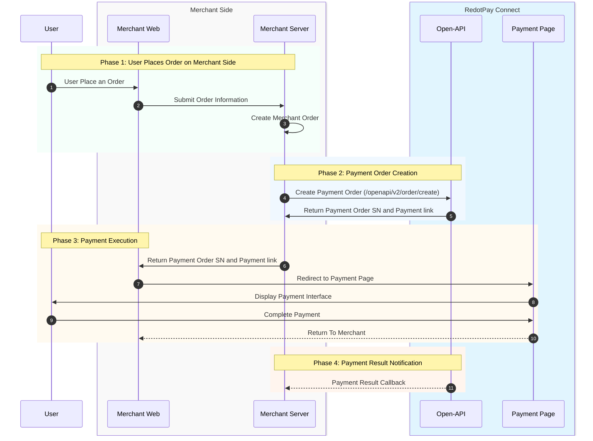

```mermaid
sequenceDiagram
    participant Alice
    participant Bob

    box rgb(249, 249, 249) Test Group
        participant Service
    end

    Alice->>Service: Test request
    Service-->>Alice: Test response
```

```mermaid
sequenceDiagram
autonumber
participant User as User
box rgb(249, 249, 249) Merchant Side
participant App as Merchant Web
participant Backend as Merchant Server
end
box rgb(225, 245, 254) RedotPay Connect
participant API as Open-API
participant SDK as Payment Page
end
rect rgb(245, 255, 250)
note over User, Backend: Phase 1: User Places Order on Merchant Side
User->>App: User Place an Order
App->>Backend: Submit Order Information
Backend->>Backend: Create Merchant Order
end
rect rgb(240, 248, 255)
note over Backend, API: Phase 2: Payment Order Creation
Backend->>API: Create Payment Order (/openapi/v2/order/create)
API->>Backend: Return Payment Order SN and Payment link
end
rect rgb(255, 250, 240)
note over App, User: Phase 3: Payment Execution
Backend->>App: Return Payment Order SN and Payment link
App->>SDK: Redirect to Payment Page
SDK->>User: Display Payment Interface
User->>SDK: Complete Payment
SDK-->>App: Return To Merchant
end
rect rgb(255, 245, 238)
note over API, Backend: Phase 4: Payment Result Notification
API-->>Backend: Payment Result Callback
end
```
